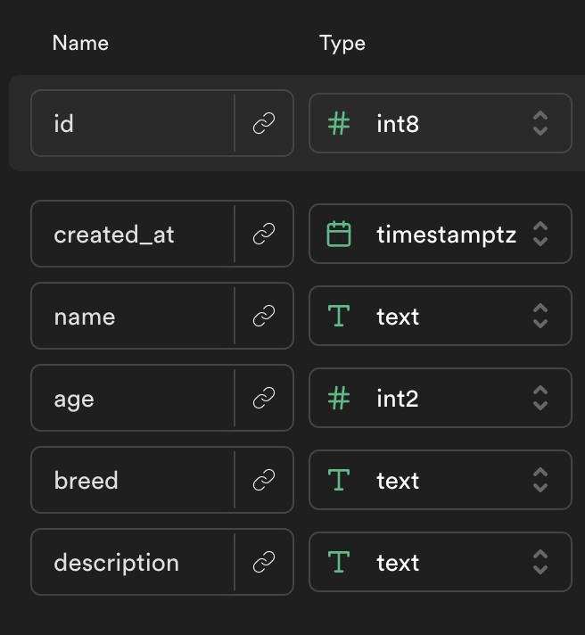

# Supabase Dog Adoption App

Use [this template](https://github.com/alchemycodelab/half-baked-web-01-adopt-a-dog) for this deliverable.

## Learning Objectives

-   Draw a simple architecture diagram describing the relationship between a user's computer and a single RESTful API.
-   On load, use fetch and async/await to hit a GET endpoint, get all items, and set state and update the view using the response.
-   In front end apps with asynchronous behavior, use the network tab to examine (and debug) the request being sent to a server and the response received from a server.

Here is the model for the `dogs` table

### Live Example:

https://alchemycodelab.github.io/web-01-adopt-a-dog/

### Description

For this deliverable you have been given a supabase database and some render functions. Your job is to add the code in `fetch-utils.js`, `app.js` and `detail.js` to render the list of animals and the details page.

## Rubric

The following is required for your assignment to be graded:

-   PR open from `dev` to `main`
-   PR Passes CI (lint + tests)
-   PR preview on netlify
-   At least 4 commits, for each working feature

| Tasks...                                                                                       | **10** |
| ---------------------------------------------------------------------------------------------- | ------ |
| ASYNC: `getDogs()` : return array of dogs from supabase                                        | 1      |
| On load on the home page, see a list of dogs (names and breed image), fetched from supabase    | 2      |
| On clicking a dog, user should be taken to that dog's detail page.                             | 2      |
| ASYNC: `getDog(id)` : return single dog from supabase                                          | 1      |
| Detail page should get the id from the URL and use that id to fetch that dog from supabase.    | 2      |
| Detail page should show the user details about the dog (including age, breed, and description) | 2      |
